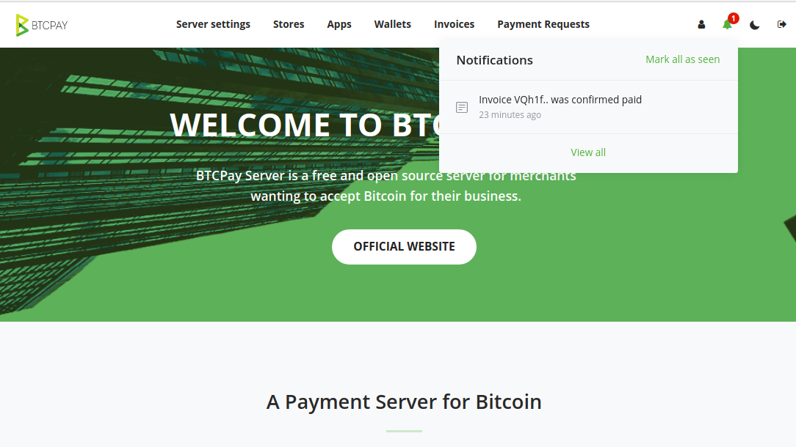
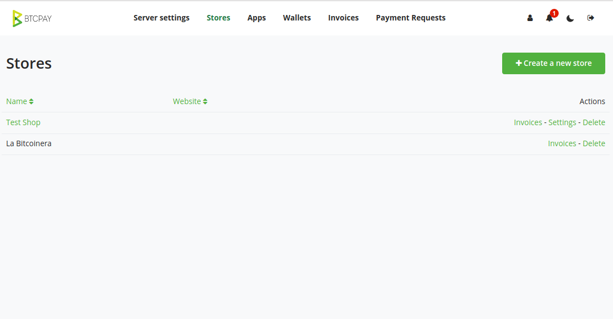
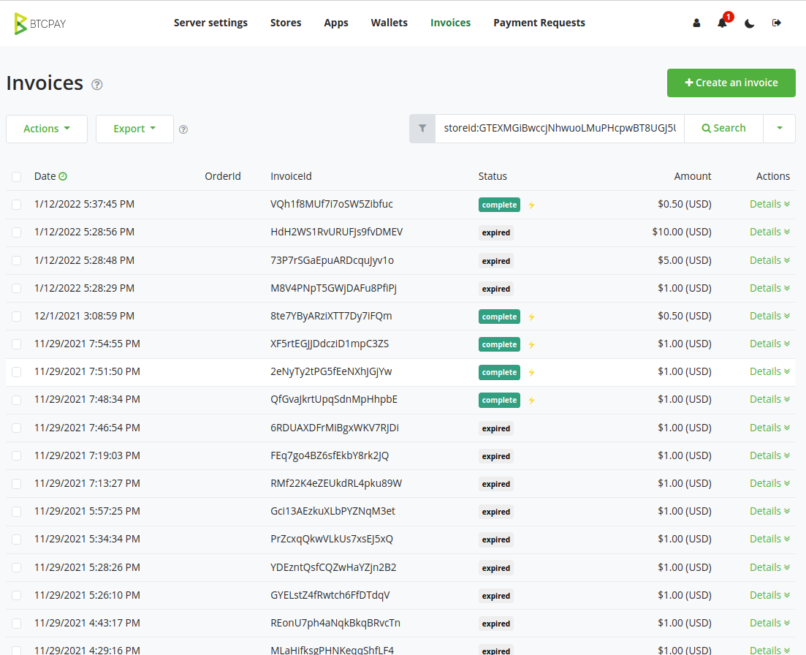
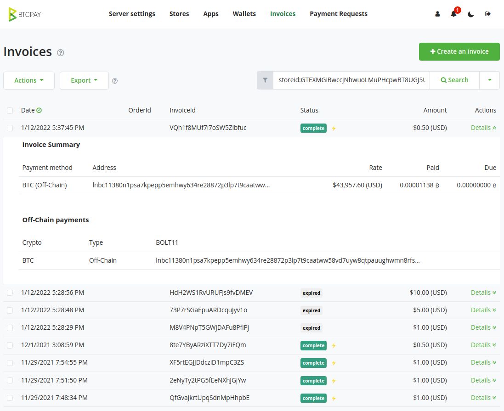
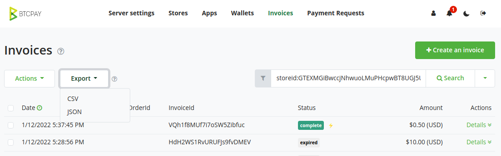

Ingresando a [<mark>BTCPay</mark>](https://btcpay.tatacoabitcoin.com/) con tu nombre de usuario 
y contraseña, podrás encontrar el historial de transacciones de tu negocio, información detallada 
de cada operación y generar reportes.

---
## Cómo usar BTCPay

Asegurate de ingresar a la dirección [<mark>https://btcpay.tatacoabitcoin.com/</mark>](https://btcpay.tatacoabitcoin.com/),
allí encontrarás la pantalla de inicio de sesión donde podrás ingresar tu nombre de usuario y
contraseña. Una vez inicies sesión, el ícono de la campana ubicado en la parte superior derecha
en la barra de navegación muestra notificaciones de nuevas transacciones desde tu último ingreso.
#

#
En la sección 'Stores' estarán listados todos las tiendas que hayas creado con nosotros. podrás
acceder a la información de cada comercio haciendo click en el botón 'Invoices' ubicado a la derecha
de este.
#

#
En esta sección podrás encontrar todas las ordenes de pago creadas por tu negocio, su fecha y valor.
Adicionalmente podrás ordenarlas por fecha, estado del pago, etc.
#

#
Al hacer click en el botón 'Details', es posible encontrar más detalles de cada transacción, tales como
la tasa de cambio al momento del pago, tipo de pago y equivalente en Satoshis.
#

#
Finalmente, es posible generar reportes y exportar toda esta información usando el botón 'Export'.
#

#

---

Photo by <a href="https://unsplash.com/@adeolueletu?utm_source=unsplash&utm_medium=referral&utm_content=creditCopyText">Adeolu Eletu</a> on <a href="https://unsplash.com/collections/238585/highre-pics?utm_source=unsplash&utm_medium=referral&utm_content=creditCopyText">Unsplash</a>
