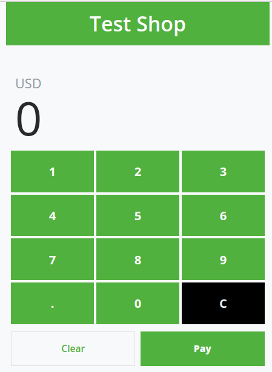
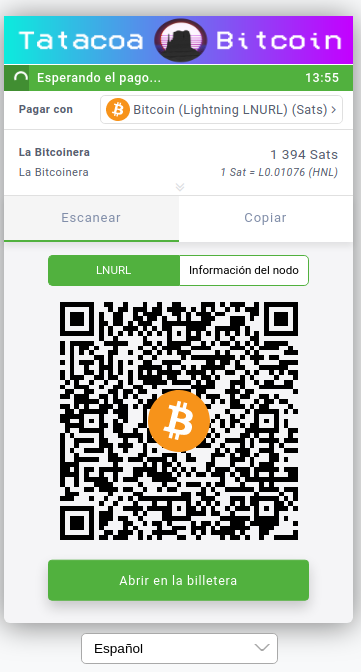
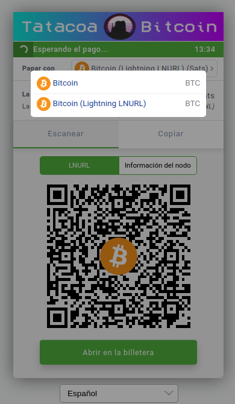
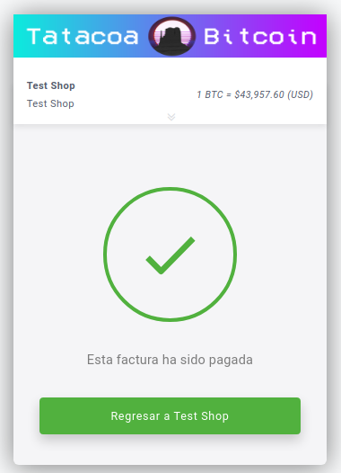

Bienvenido al futuro, ahora puedes recibir pagos en Bitcoin onchain y Lightning.
Usar tu aplicación de punto de venta es súper fácil. Aquí te contamos cómo.

---
## App POS

Para usar la aplicación de punto de venta tan solo necesitas la url que hemos
enviado a tu correo. No necesitas ingresar con tu usuario de BTCPay. Esta aplicación puede ser usada desde cualquier dispositivo
a través de un navegador. Por ejemplo, desde un teléfono móvil o un computador
por medio del navegador Chrome. [<mark>Ingresar</mark>](https://BTCPay.tatacoabitcoin.com/apps/2oGdKGkUxoR2ZmaGSfCCziZQ5ji3/pos)
#

#
Una vez ingreses la cantidad del pago, haz click en el botón <mark>Pagar</mark>
para continuar a la siguiente pantalla donde se generará un código QR con la orden
de pago.
#

#
Puedes cambiar el método de pago haciendo click en el botón 'Pagar con',
un menú te mostrará las opciones disponibles.
#

#
Permite que el cliente escanee el código QR con su teléfono para efectuar el pago.
Recuerda que la orden generada tiene una ventana de pago de 15 minutos,
en los cuales se puede hacer el pago total o varios pagos parciales hasta completar el total
de la factura. Si el pago no se completa dentro de estos 15 minutos, deberás generar 
una nueva orden de pago. Una vez hecho el pago, en unos segundos verás la pantalla de confirmación.
#

#
Listo! has completado tu primera venta. Haciendo click en el botón 'Regresar'
puedes volver a la aplicación de punto de venta. Puedes ver el detalle de esta y todas las
transacciones que realices ingresando con tu usuario y contraseña a 
[<mark>https://btcpay.tatacoabitcoin.com/</mark>](https://btcpay.tatacoabitcoin.com/)

---

Photo by <a href="https://unsplash.com/@claybanks?utm_source=unsplash&utm_medium=referral&utm_content=creditCopyText">Clay Banks</a> on <a href="https://unsplash.com/s/photos/point-of-sale?utm_source=unsplash&utm_medium=referral&utm_content=creditCopyText">Unsplash</a>
  