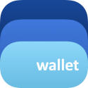

Bitcoin sobre la red Lightning permite a sus usuarios enviar y recibir pagos más rápido y a un menor costo que si usaran la red primaria de Bitcoin.

Para empezar a usar Bitcoin Lightning, necesita instalar una billetera que tenga soporte de esta red. A continuación presentamos varias opciones:

---
## Billeteras con custodia

En las billeteras con custodia, uno no tiene la frase semilla o de recuperación, por lo tanto un tercero tiene la custodia de mis criptomonedas. 
Recuerden <mark>"Not your keys, not your coins"</mark>. Este tipo de billetera es ideal para personas iniciando en el criptomundo porque ofrecen una 
manera fácil y rápida de empezar a usar Bitcoin.

-   #### [Wallet of Satoshi](https://www.walletofsatoshi.com/)
    
    -   Soporte para idioma español y pesos colombianos (COP)
    -   Disponible para Android y iOS
    -   El registro con un email permite el respaldo de la cuenta
    -   En nuestra experiencia, <mark>la más fácil de usar</mark>

-   #### [Blue Wallet](https://bluewallet.io/)
    
    -   Código abierto
    -   Soporte para idioma español y pesos colombianos (COP)
    -   Disponible para Android, iOS y escritorio.

---

## Billeteras sin custodia

Con esta clase de billetera, el usuario es completamente dueño y responsable de la custodia de sus monedas y es recomendada para usuarios mas
experimentados. El usuario debe almacenar la frase semilla en un lugar seguro.

-   #### [Breez](https://breez.technology/)
    
    -   Código abierto
    -   Permite crear respaldos con iCloud o Nextcloud 
    -   Disponible para Android y iOS

-   #### [Phoenix](https://phoenix.acinq.co/)
    
    -   Código abierto
    -   Disponible para Android y iOS

-   #### [Muun](https://muun.com/)
    
    -   Código abierto
    -   Soporte para idioma español y pesos colombianos (COP)
    -   Disponible para Android y iOS

-   #### [Simple Bitcoin Wallet](https://lightning-wallet.com/)
    
    -   Código abierto
    -   Disponible para Android

---

Photo by <a href="https://unsplash.com/@bermixstudio?utm_source=unsplash&utm_medium=referral&utm_content=creditCopyText">Bermix Studio</a> on <a href="https://unsplash.com/s/photos/bitcoin?utm_source=unsplash&utm_medium=referral&utm_content=creditCopyText">Unsplash</a>
  
