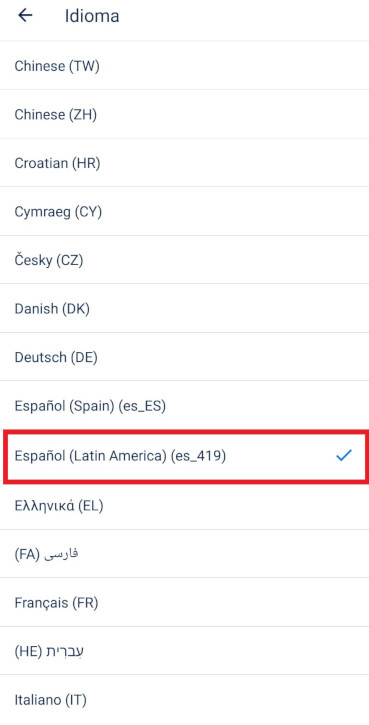
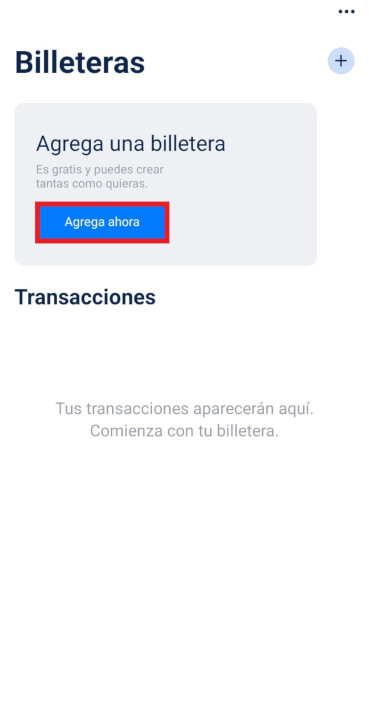
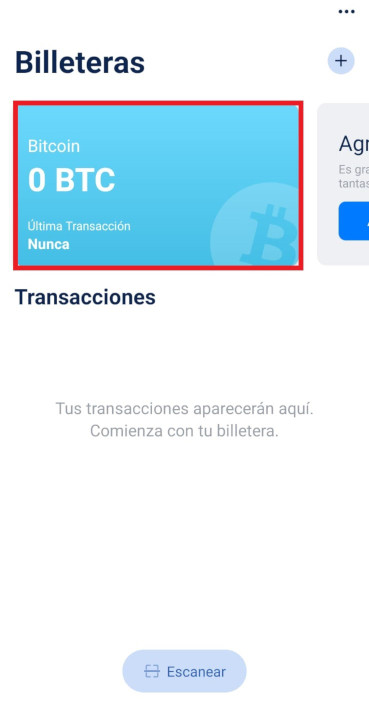

Has decidido dar el primer gran paso, ingresar al criptomundo comprando un poco de Bitcoin. Para esto debes crear una
billetera en la cual almacenar tus monedas, es muy fácil y no tiene ningún costo. A continuación te contamos cómo.

---

### 1. Instala la aplicación en tu teléfono
En el post anterior presentamos varias opciones de billeteras. En este caso, vamos a usar <u>[Blue Wallet](https://bluewallet.io/)</u>,
la cual está disponible para iOS y Android.
#

### 2. Configura el idioma y divisa
Una vez instalada la aplicación, accede a ella y asegurate que la configuración corresponde a tu lenguaje y divisa local.
#

#

Bajo Language/Idiomas marca la opción "Español"
#

Bajo Currency/Divisa marca la opción "COP($)"

### 3. Agrega una billetera
Presiona la opción "Agrega ahora" Puedes crear tantas billeteras como quieras, es gratis.
#

Puedes darle un nombre a tu billetera o dejar el que tiene por defecto. Selecciona la opción "Bitcoin" y presiona en el botón "Crear".
#

A continuación, aparecerá un listado de palabras en pantalla. <mark>Es muy importante que escribas este listado en un papel y 
que lo guardes en un lugar seguro. No tomes un pantallazo o captura de pantalla. Asegúrate de no perderlo! este listado 
es la única forma de recuperar el acceso a tus criptomonedas si pierdes el teléfono o reinstalas la aplicación.</mark>

### 4. Recibe y envia Bitcoin 
Todo listo, has creado tu primera billetera. Para recibir Bitcoin, selecciona la billetera que creaste.
#

En la parte inferior, presiona el botón "Recibir".
#

Allí aparece un código QR que puede ser leído por otra billetera o una dirección compuesta por letras y números. Al tocar esta
dirección, se copiará para que la puedas compartir.
#

---

Photo by <a href="https://unsplash.com/@bermixstudio?utm_source=unsplash&utm_medium=referral&utm_content=creditCopyText">Bermix Studio</a> on <a href="https://unsplash.com/s/photos/bitcoin?utm_source=unsplash&utm_medium=referral&utm_content=creditCopyText">Unsplash</a>
  
