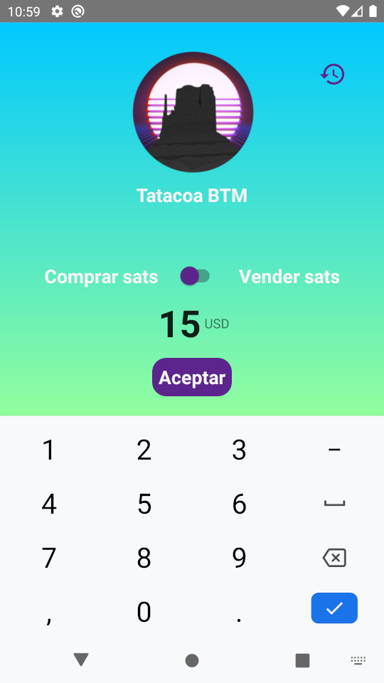
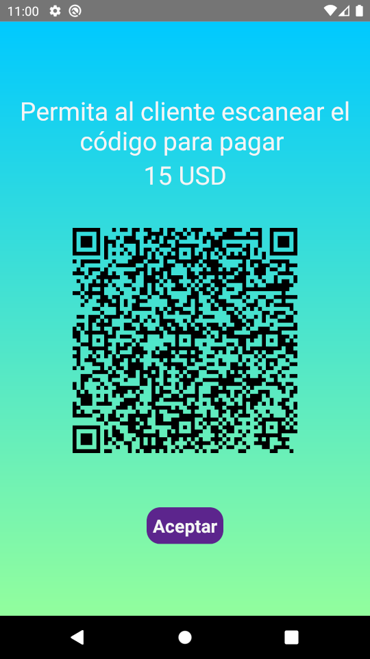
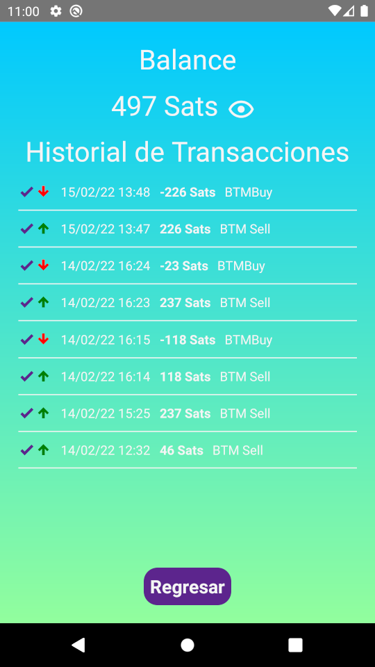

Tatacoa Bitcoin trabaja incansablemente para masificar la adopción de Bitcoin en el mundo. Actualmente existen barreras que dificultan
esta razón hemos creado soluciones para hacer la compra y la venta de Bitcoin mucho más fácil.

## Prototipo BTM

Los cajeros físicos aceptan monedas de cualquier denominación. Convierte esas monedas que no usas en Bitcoin. Búscalos
pronto en todas las esquinas.

## BTM Asistido

Esta aplicación móvil esta orientada para ser utilizada por comerciantes. Comprar y vender Bitcoin es tan fácil como recargar tu
celular. Disponible para teléfonos Android en la Play Store.

<Row>
<Col>

#### Compra

</Col>
<Col>

#### Venta

</Col>
</Row>

<Row>
<Col>

#### Código QR para pagos/retiros

</Col>
<Col>

#### Historial

</Col>
</Row>
